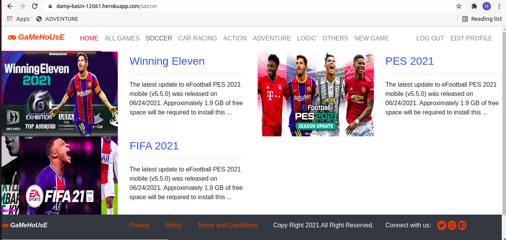

# Microverse ROR Capstone Project - Blog app(Gamehouse)
This project is a Game blogging app, where users can register, start writing about the latest games, read about games descriptions written by others users, and users can vote/unvote game or games.The game with the highest votes get featured(takes a full width of the home page).

## Project features

- Users can create accounts and log in.
- When logged in, users can create game articles, update or delete them.
- When logged in users, a user can vote a game(article).
- Featured game article is showed at the top which is the most voted game.
- When a game article is created the category and name of the game is showed on the home page.
- When a user clicks on the specific category it sorts games(article) just by that category
- In categories right side field users can see how many articles each category has.
- when you click on "NEW GAME",a form with all necessary fields is displayed.





## Built With

- ruby 2.7.2p137
- Ruby on Rails v6.1.4

## Live Demo
[Live Demo Link](https://damp-basin-12061.herokuapp.com/)


## Getting Started

To get a local copy up and running follow these simple example steps.

### Prerequisites

- ruby 2.7.2p137
- Ruby on Rails v6.1.4
- Postgres:  v1.1'

### Setup

Instal gems with:

```
bundle install
```

Setup database with:

```
   rails db:create
   rails db:migrate
```

### Github Actions

To make sure the linters' checks using Github Actions work properly, you should follow the next steps:

1. On your recently forked repo, enable the GitHub Actions in the Actions tab.
2. Create the `feature-branch/branch` and push.
3. Start working on your milestone as usual.
4. Open a PR from the `feature-branch/branch` when your work is done.


### Usage

Start server with:

```
    rails server
```

Open `http://localhost:3000/` in your browser.

### Run tests

```
    rspec --format documentation
```
Sometimes you can be asked to check files with yarn, so run this command:

```bash
    yarn install --check files 
```


## Author

👤 **HENRY ONU**

- GitHub: [@githubhandle](https://github.com/Henryhaulka)
- Twitter: [@twitterhandle](https://twitter.com/ONUHENRY12)
- LinkedIn: [LinkedIn](https://www.linkedin.com/in/henry-onu)


## 🤝 Contributing

Contributions, issues and feature requests are welcome!

Feel free to check the [issues page](https://github.com/Henryhaulka/ROR-capstone/issues/).

## Show your support

Give a ⭐️ if you like this project!

## Acknowledgments
- This Project was inspired by Microverse
- The Creative Commons license


